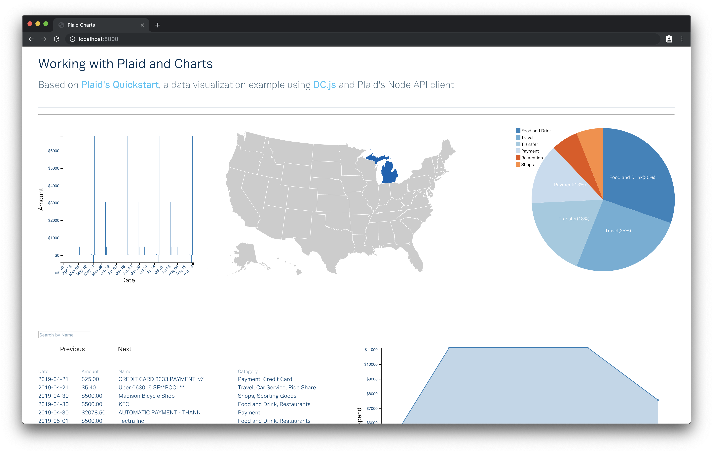

# Plaid Charts

An example webapp that pulls data from Plaid's API and visualizes it, using [dc.js](https://dc-js.github.io/dc.js/) and based on [Plaid's Quickstart app](https://github.com/plaid/quickstart/tree/master/node).

## Running locally

### Sandbox
These instructions will run a `sandbox` instance, allowing you to use fake credentials. 

To run locally:

    git clone git@github.com:jdk2pq/plaid-charts.git
    cd plaid-charts
    yarn # or npm install
    vim .sandbox.env
    
    # Add the following to your .sandbox.env file:
    APP_PORT=8000 # or whichever port you prefer
    PLAID_CLIENT_ID={your-client-id}
    PLAID_SECRET={your-client-secret}
    PLAID_PUBLIC_KEY={your-public-key}
    PLAID_PRODUCTS=transactions # and additional products you need
    PLAID_COUNTRY_CODES=US,CA,GB,FR,ES # and additional country codes you need
 
    # Save the file, and then run
    
    yarn start:sandbox # or npm run start:sandbox
     
### Development
These instructions will run a `development` instance, allowing you to use live credentials. 

To run locally:

    git clone git@github.com:jdk2pq/plaid-charts.git
    cd plaid-charts
    vim .development.env
    
    # Add the following to your .development.env file:
    APP_PORT=8000 # or whichever port you prefer
    PLAID_CLIENT_ID={your-client-id}
    PLAID_SECRET={your-client-secret}
    PLAID_PUBLIC_KEY={your-public-key}
    PLAID_PRODUCTS=transactions # and additional products you need
    PLAID_COUNTRY_CODES=US,CA,GB,FR,ES # and additional country codes you need
 
    # Save the file, and then run
    
    yarn start:development # or npm run start:development
